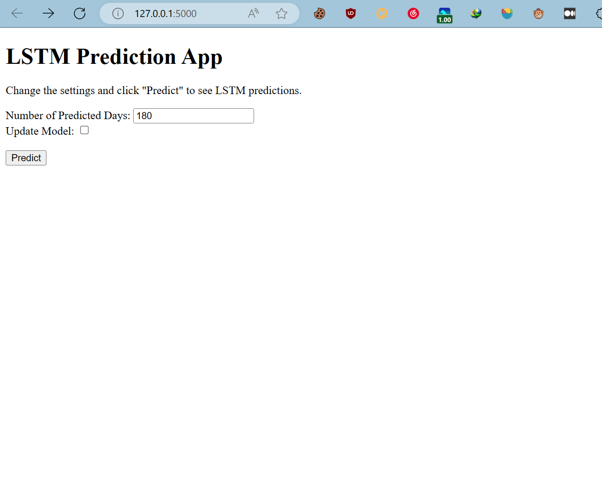
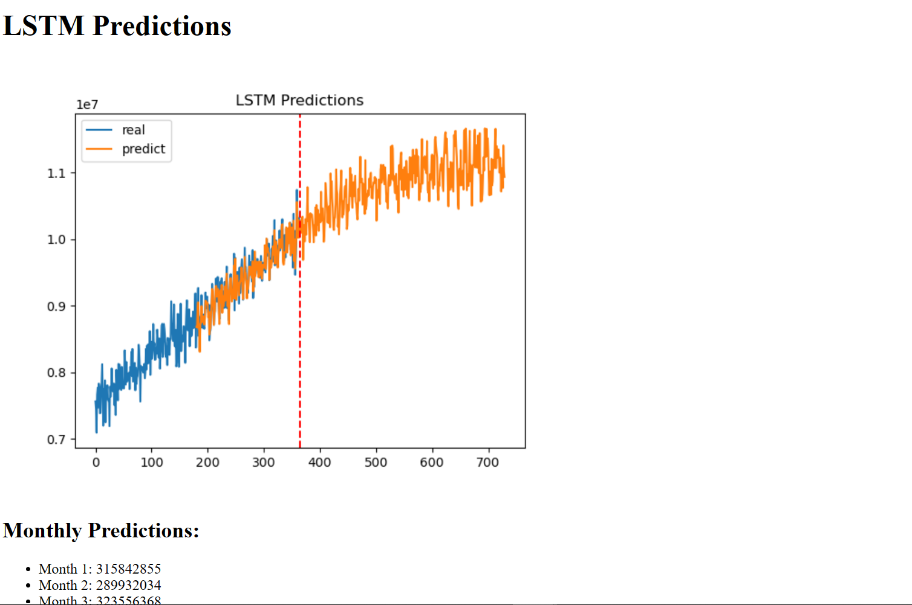

# LSTM model for data prediction

### This project is the fetch interview project (got rejected in (1/3) round)

## How to use it
- install the required library
```
pip install -r requirements.txt
```

- In your command Line run
```
python3 app.py
```
or if you're using conda and set python3 as default python environment
```
python app.py
```

You should see in your command line prompt with something like
```
 * Serving Flask app "app" (lazy loading)
 * Environment: production
   WARNING: This is a development server. Do not use it in a production deployment.
   Use a production WSGI server instead.
 * Debug mode: on
 * Restarting with watchdog (windowsapi)
 * Debugger is active!
 * Debugger PIN: 730-526-129
 * Running on http://127.0.0.1:5000/ (Press CTRL+C to quit)
127.0.0.1 - - [01/Oct/2023 11:37:29] "GET / HTTP/1.1" 200 -
```

Then you should be able to go to the http address created by the server. i.e. http://127.0.0.1:5000/

After open in your browser with this address, you should see the following 

- I suggest you run with the default Look Ahead days with 180, since I have FineTuned for this data. And the input of Look Ahead should be less than 180

After Clicking the Predict bottom, you may wait for a second. Letting the model to do the arithmetics, you're welcomed to monitor the loss function on your command Line.

Then you should see the prediction image , with the prediction of monthly total 

- If you choose to check the box update model, the model will be updated with the prediction it made, it will take much longer to complete the job. And you'll be able to see the progress in the commandline shell.

### One Important Thing is that the app didn't support refreshing the prediction picture it made, if you try some new input, the Monthly Predictions will Change, but If you want to observe the new prediction picture, You have to restart the app

### Run without interface
run
```
python main.py
```

Directly through the commandline, and with two questions 
1. update model, input Y or N
2. days of look ahead, choose a number below 180. But I recommend 180 since it has benn tuned.
